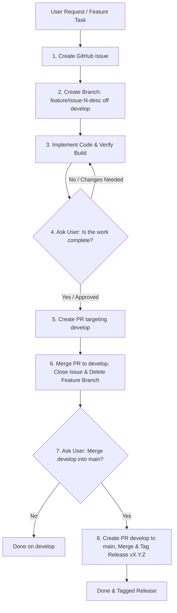

# Mandatory GitHub SDLC Workflow & Branching Guidelines

This document outlines the strict step-by-step GitHub workflow and branching standard required for all software development tasks in this repository.

---

## Standard Step-by-Step Workflow



### 1. Step 1: Create GitHub Issue
- Before starting any code modifications or creating branches, create an issue on GitHub:
  ```bash
  gh issue create --title "<Type>: <Title>" --body "<Detailed Scope>"
  ```
- Document local issue file in `docs/issues/ISSUE-XXX.md`.

### 2. Step 2: Create Feature Branch Off `develop`
- Branch off `develop` using strict naming conventions:
  - Features: `feature/issue-<NUMBER>-<short-description>`
  - Bug Fixes: `fix/issue-<NUMBER>-<short-description>`
  - Refactoring: `refactor/issue-<NUMBER>-<short-description>`
- Example:
  ```bash
  git checkout develop && git pull origin develop
  git checkout -b feature/issue-29-add-export-csv
  ```

### 3. Step 3: Implement Code & Local Build Verification
- Implement the requested feature or fix on the dedicated branch.
- Run `npm run build` to verify clean compilation with **0 errors**.

### 4. Step 4: User Verification Prompt
- **MANDATORY CHECKPOINT**: Ask the user if the work is complete and satisfactory:
  > *"I have implemented [Feature/Fix] on `feature/issue-N-desc` and verified the build. Is the work complete and ready to create a Pull Request to `develop`?"*

### 5. Step 5: Create Pull Request to `develop`
- Once the user confirms completion, push the branch and open a PR targeting `develop`:
  ```bash
  git push -u origin feature/issue-<NUMBER>-<short-description>
  gh pr create --base develop --head feature/issue-<NUMBER>-<short-description> --title "<title> [ISSUE-XXX]" --body "Closes #<NUMBER>"
  ```

### 6. Step 6: Merge PR, Close Issue & Delete Feature Branch
- Merge PR into `develop`:
  ```bash
  gh pr merge <PR_NUMBER> --merge --delete-branch
  ```
- Close GitHub Issue:
  ```bash
  gh issue close <ISSUE_NUMBER>
  ```
- Clean up local branch:
  ```bash
  git checkout develop && git pull origin develop
  git branch -d feature/issue-<NUMBER>-<short-description>
  ```

### 7. Step 7: Main Release Prompt & Archiving
- **MANDATORY CHECKPOINT**: Ask the user if they want to merge `develop` into `main` and publish a release:
  > *"The feature has been merged into `develop` and the issue/branch closed. Would you like to merge `develop` into `main` and tag a production release?"*
- If user confirms **YES**:
  - Create release PR: `gh pr create --base main --head develop --title "release: vX.Y.Z" --body "..."`
  - Merge into `main`: `gh pr merge <PR_NUMBER> --merge`
  - Create GitHub Tag / Release: `gh release create vX.Y.Z --notes "Release vX.Y.Z"`
  - Optionally create archive snapshot branch for stable version: `git branch archive/vX.Y.Z main && git push origin archive/vX.Y.Z`.

---

## Summary Matrix

| Phase | Branch | Trigger | Action | Approval Needed? |
| :--- | :--- | :--- | :--- | :--- |
| 1. Issue | `develop` | Task Start | `gh issue create` | No |
| 2. Feature Branch | `feature/issue-N-*` | Issue Opened | `git checkout -b` | No |
| 3. Code & Build | `feature/issue-N-*` | Development | Code + `npm run build` | No |
| 4. User Prompt | `feature/issue-N-*` | Code Done | Ask User | **YES** |
| 5. PR to `develop` | `feature/issue-N-*` | User Confirmed | `gh pr create --base develop` | No |
| 6. Merge & Close | `develop` | PR Created | Merge PR, Close Issue, Delete Branch | No |
| 7. Main Release | `main` | `develop` Merged | Ask User $\rightarrow$ PR to `main` $\rightarrow$ `gh release create` | **YES** |
